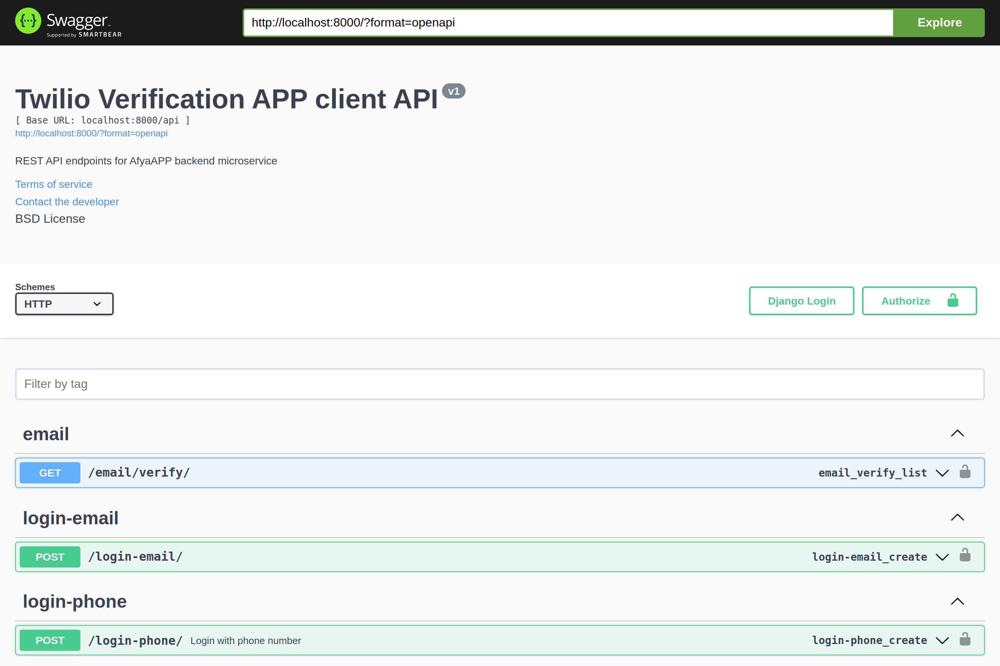
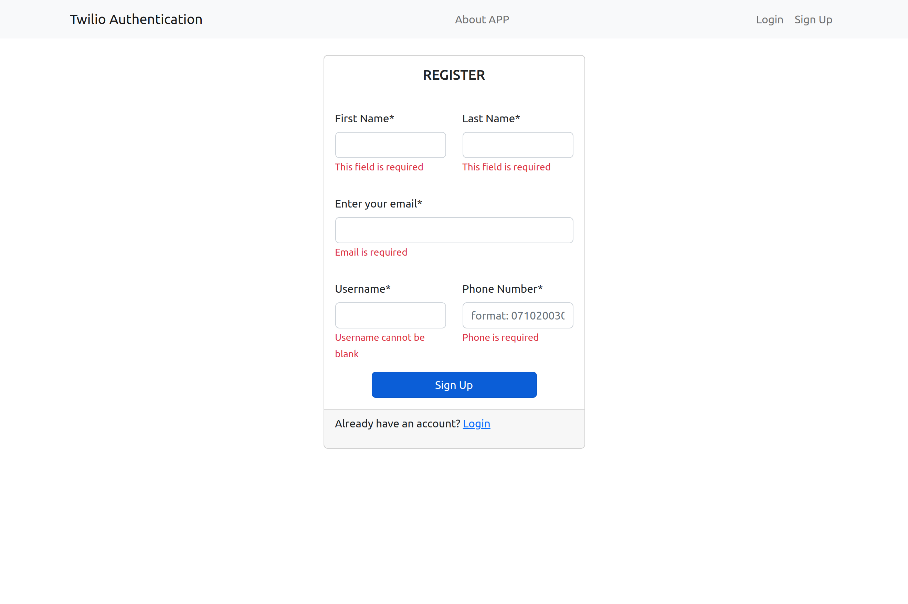
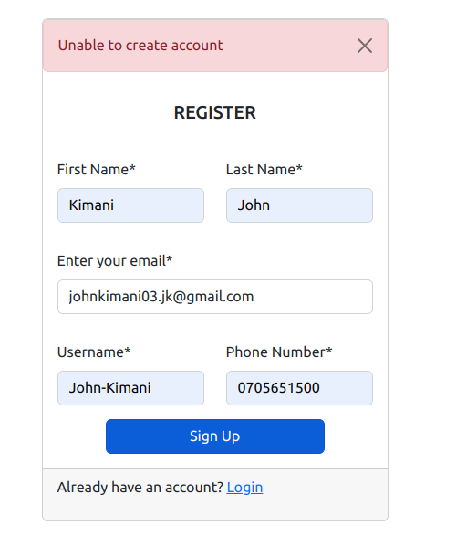
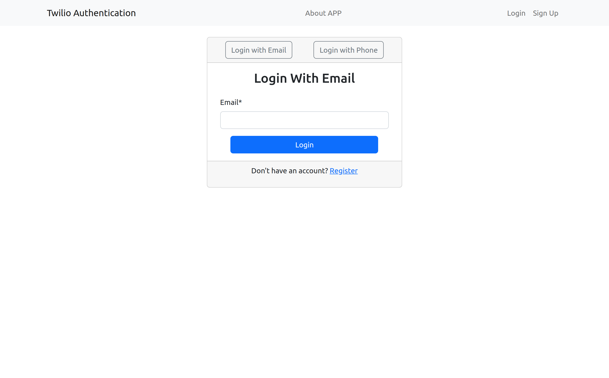
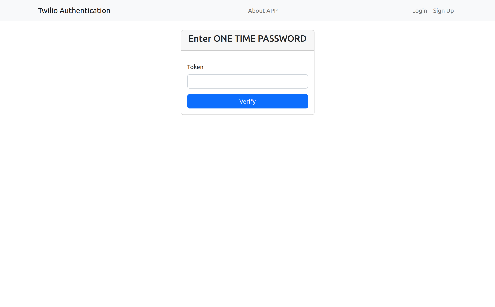
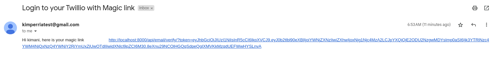

## Twillo OTP web system
This is a simple fullstack web authentication application that can be user to authenticate users using One Time Password sent as Magic link or SMS enabled by Twilio.

## ABOUT PROJECT

This application is built in two servers.
1. Client server built with Vite + React
2. Backend server built with Django, DRF and SQLite.

#### Brief

This is a password-less authentication system using JWT with React for front-end and Django for the back-end.

#### User scenarios
If the user exists with that email it sends them both an OTP and a magic link with the URL having both a OTP and the user email;

For an existing user, after the user enters their email or phone number, it should redirect them to enter the OTP;

For a new user, it should prompt the user to confirm their new account creation details then send out the same, OTP for phone number registration and both OTP and magic link for an email account registration;

For users using their phone number it sends only the OTP.

**NB** Using React to authenticate the user, it uses the sent back credentials either OTP or URL to create JWT which you’ll then use to authenticate the user
#### Workflow
- Please see the attached [application workflow](https://www.figma.com/file/aZCG7ZbIvXO08lPmpwXc09/Password-less-authentication?type=whiteboard&node-id=0%3A1&t=IFis6uPpzFFEkiUS-1).

### Screenshot
---
1. Sample endpoints

2. Validated client registration form

3. Flashed responses

4. Login options

5. Verify OTP

6. Inbox with magic link

## Technologies used
---
#### Frontend(client)
- Vite React + JS
- Bootstrap

#### Backend(server)
- Django and SQL database.
- Django rest framework.

## Author
---
This project was designed and developed by : [Kimani John](https://kimanijohn.netlify.app/)